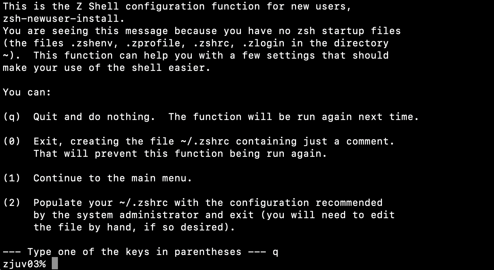
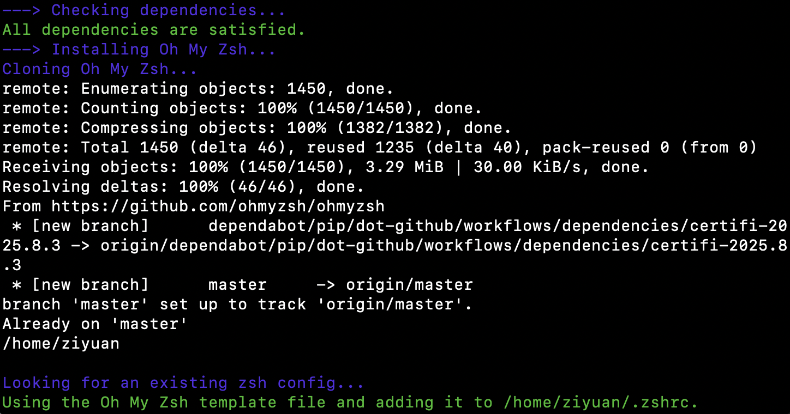
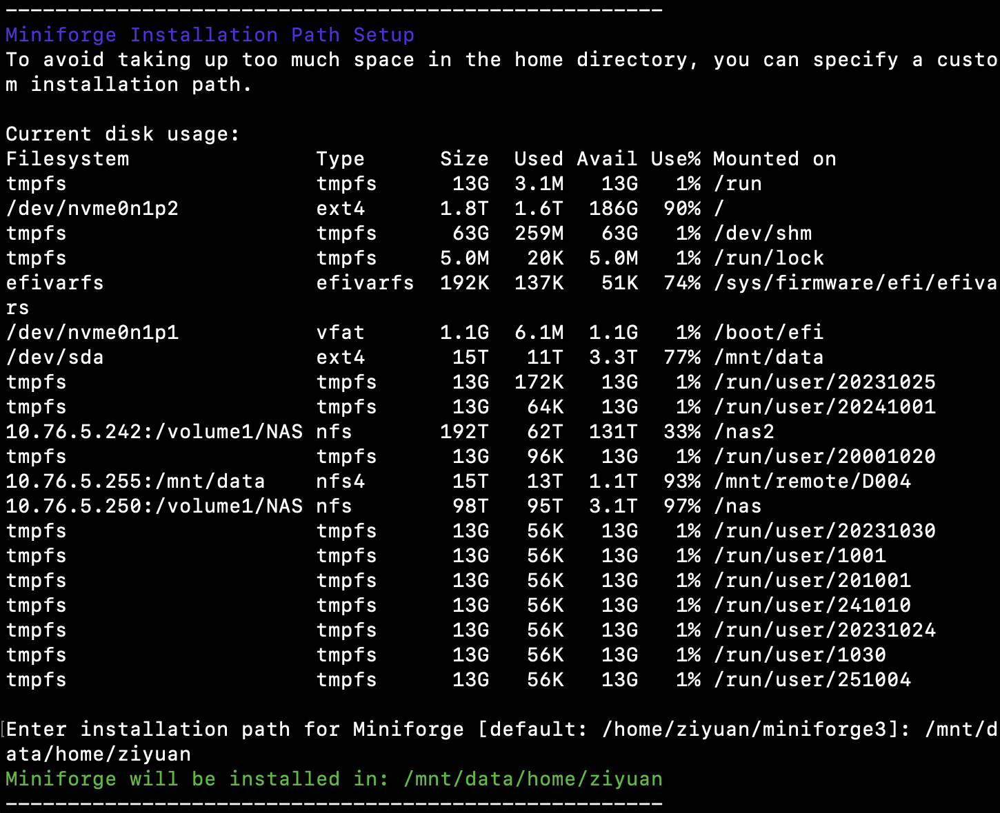
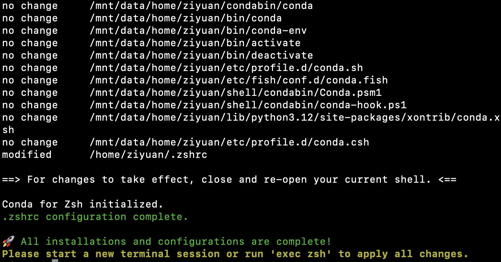
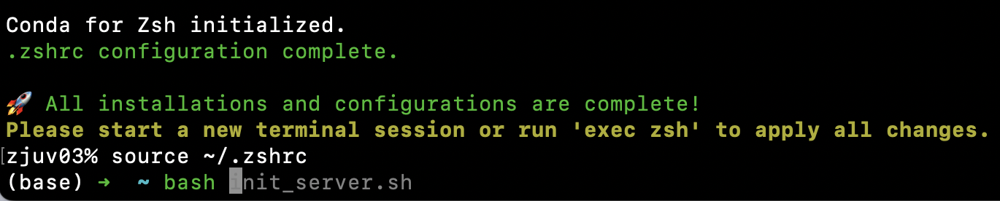

# Init-Server

Initialize a (linux) server to install `oh-my-zsh, autosuggestions, zsh-syntax-highlighting, autojump, miniforge3 and fzf` with only one command: `bash init.sh`! Support mannully setting the installation path for `miniforge3`.

## Before: Black and white, monotonous and boring 👎



## Installing: All automatically installed! 🤖



Allow user to manually set the installation path for `miniforge3` to avoid occupying too much space at the home directory:





## Installed: Colorful, beautiful and fun 👍



## How to use

1. Clone this repo

```bash
git clone git@github.com:RukawaY/Init-Server.git
cd Init-Server
```

2. Run `bash init.sh` or `bash init_with_proxy.sh`

**Note**: If you are in China, you can run `bash init_with_proxy.sh` to use the proxy to install the packages. Make sure you have the proxy environment variables set.

3. Enjoy!